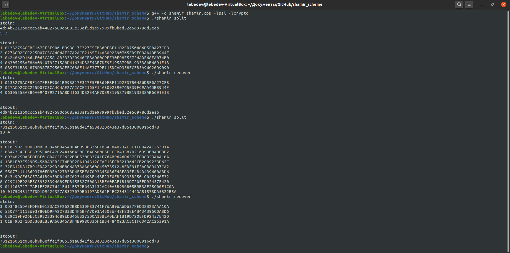

# Схема разделения секрета шамира

### Описание программы
Программа, разделяющая приватный ключ ECDSA сurve25519 на N частей по схеме Шамира и восстанавливающая его при предъявлении любых T частей.
https://park.mail.ru/curriculum/program/lesson/14832/#homework_5096

### Конфигурация
Программа получает на вход единственный аргумент указывающий режим работы программы:
> ./program split - режим разделения приватного ключа

> ./program recover - режим восстановления приватного ключа

### Сборка
Чтобы собрать проект в командной строке напишите: 
> g++ -o shamir shamir.cpp -lssl -lcrypto

### Запуск

#### Режим разделения приватного ключа
Чтобы запустить проект в режиме разделения приватного ключа в командной строке напишите: 
> ./shamir split

После этого введите с клавиатуры два параметра через пробел: N T

#### Режим восстановления приватного ключа
Чтобы запустить проект в режиме восстановления приватного ключа в командной строке напишите: 
> ./shamir recover

После этого вводите T кусков ключей с клавиатуры через enter.
Программа будет считывать ваши ключи до тех пор пока вы не введете пустую строку.

Например:
> 3 049C3A0FC21923A91E656294018C7473C31E885A6ABF86F02BC2C67D04779F01BF

> 4 0748FFBFB3294CA3D2281293AB72A2C5B94BF631CC20C2EEC25AD225AD0A0C9162

> 5 0AA63EBC6A1E7A41F9A84D18BA9D553DC21B0A8EDBD03EEF860F10ACB583AD339F

### Пример сборки, запуска, работы программы

### Используемые несистемные библиотеки
openssl (https://www.openssl.org/)
