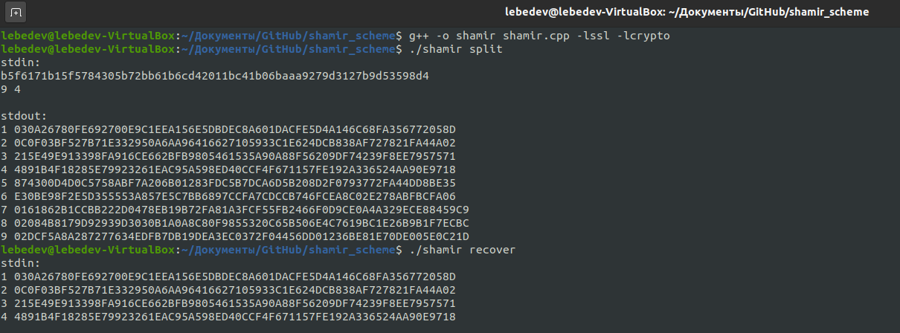

# Схема разделения секрета шамира

### Описание программы
Программа, разделяющая приватный ключ ECDSA сurve25519 на N частей по схеме Шамира и восстанавливающая его при предъявлении любых T частей.
https://park.mail.ru/curriculum/program/lesson/14832/#homework_5096

### Конфигурация
Программа получает на вход единственный аргумент указывающий режим работы программы:
./program split - режим разделения
./program recover - режим восстановления 

### Сборка
Чтобы собрать проект в командной строке напишите: 
> g++ -o shamir shamir.cpp -lssl -lcrypto

### Запуск
Чтобы запустить проект в командной строке напишите: 
> ./shamir split
или
> ./shamir recover

### Пример сборки, запуска, работы программы

### Используемые несистемные библиотеки
openssl (https://www.openssl.org/)
